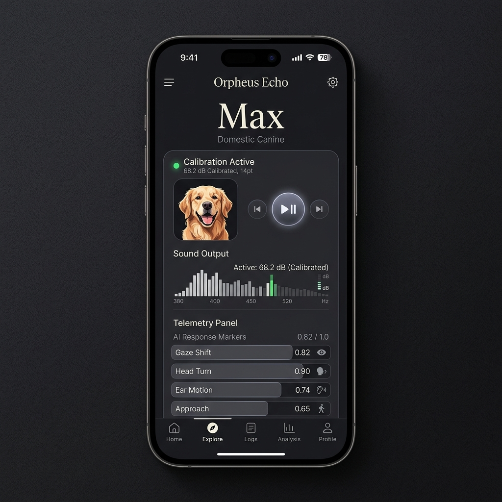
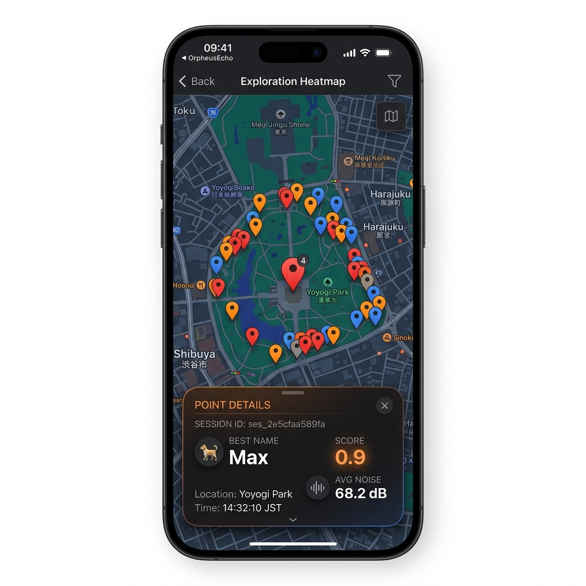
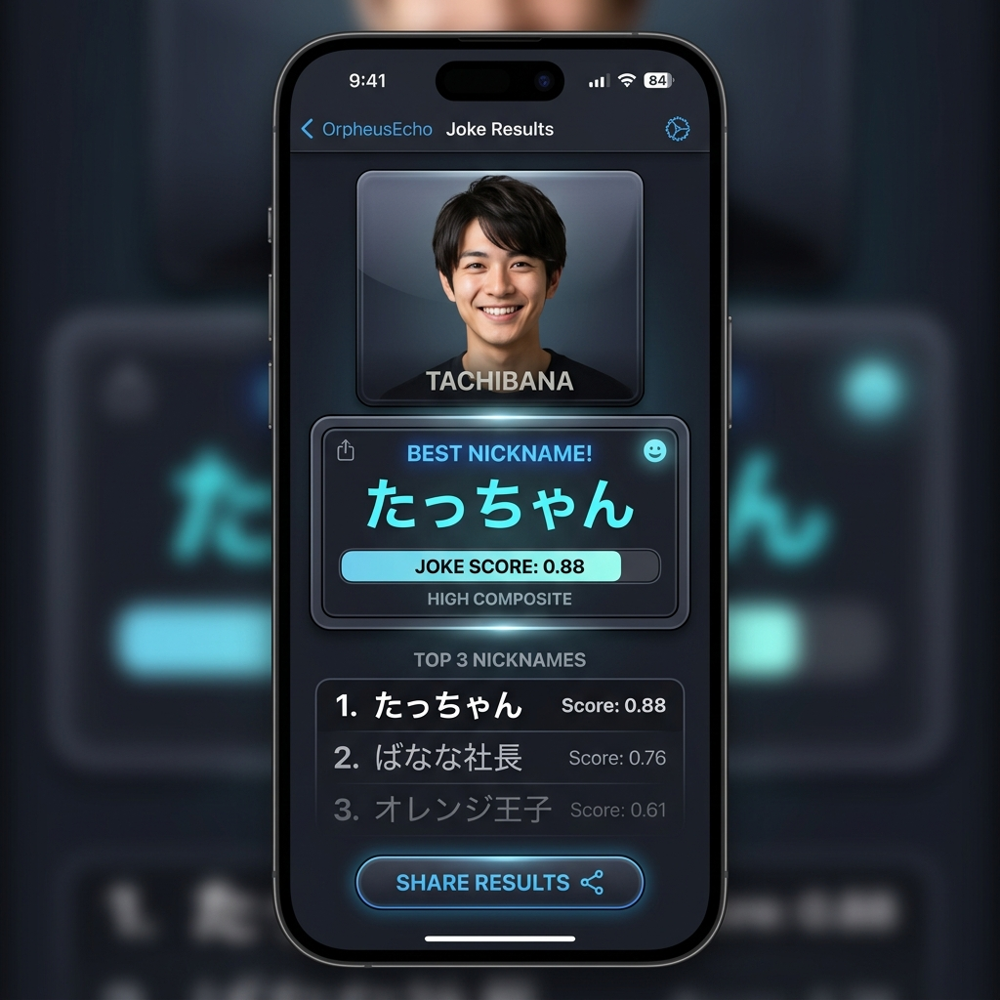

# Orpheus Echo iOS インストールガイド (iOS Build & Install Guide)

本ガイドは、開発中の SwiftUI アプリケーション「LostPetNameFinder」を macOS 上でビルドし、実機の iPhone (iOS) へインストール・デプロイする手順、およびインストール後の基本的な操作方法について説明します。

---

## 1. 必要な開発環境と前提条件

実機ビルドとデプロイを行う前に、以下の環境が揃っていることを確認してください。

- **Mac (macOS)**: macOS 14 Sonoma 以上を推奨
- **Xcode**: Xcode 15.0 以上（Swift 5.9 対応）
- **iPhone**: iOS 17.0 以上がインストールされた実機端末
- **接続ケーブル**: Mac と iPhone を接続する USB ケーブル
- **Apple ID**: 実機デプロイ用の Apple ID アカウント（無料アカウントで可能です）

---

## 2. Xcode プロジェクトの準備と構成

本アプリケーションは Swift Package Manager (SPM) 構成のパッケージとして提供されています。iOS アプリとしてビルドして実機に転送するためには、Xcode プロジェクトへの統合が必要です。

### 2.1 Xcode でのプロジェクト作成とライブラリ追加
1. Xcode を起動し、**「File」 > 「New」 > 「Project...」** を選択します。
2. iOS の **「App」** テンプレートを選択し、「Next」をクリックします。
3. プロジェクト名（例: `OrpheusEchoApp`）を入力し、Interface に **「SwiftUI」**、Language に **「Swift」** を指定して作成します。
4. 作成した Xcode プロジェクトの **「Frameworks, Libraries, and Embedded Content」** 項目へ、本パッケージを追加します：
   - **「File」 > 「Add Package Dependencies...」** を選択します。
   - **「Add Local...」** を選択し、本リポジトリの `apps/ios/LostPetNameFinder/` フォルダを指定します。
   - ターゲットメンバシップとして `LostPetNameFinder` ライブラリをアプリのメインターゲットに紐付けます。

---

## 3. プライバシー権限設定 (Info.plist)

本アプリでは、AI動作特徴量の解析とオプトインによる位置情報記録を行うため、iOS システムのプライバシー説明文（Usage Description）を設定する必要があります。

1. 新しく作成したアプリプロジェクトの `Info.plist`（または Xcode のターゲット設定にある **「Info」** タブ）を開きます。
2. 以下の2つのキーを追加し、利用目的を明記してください。

```xml
<key>NSCameraUsageDescription</key>
<string>迷子動物の呼びかけに対する反応（視線移動や頭の動きなど）をAIで推定解析するためにカメラ映像を使用します。</string>

<key>NSLocationWhenInUseUsageDescription</key>
<string>探索を開始した保護現場の位置情報をローカル履歴に記録するために位置情報サービスを使用します（オプトインによる選択時のみ）。</string>
```

> [!IMPORTANT]
> これらの設定がない場合、実機でカメラや位置情報機能を利用した瞬間に iOS のセキュリティ保護機能によってアプリが強制終了（クラッシュ）します。必ず設定してください。

---

## 4. プロキシ署名と Signing の設定

iOS 実機にインストールするためには、Apple のデジタル署名が必要です。

1. Xcode のプロジェクトナビゲータでプロジェクトのルートを選択し、ターゲットの **「Signing & Capabilities」** タブを開きます。
2. **「Automatically manage signing」** にチェックを入れます。
3. **「Team」** ドロップダウンリストから、ご自身の Apple ID（Personal Team）または登録済みの Developer Team を選択します。
4. **「Bundle Identifier」** に一意の識別名（例: `com.yourdomain.OrpheusEchoApp`）を入力します。

---

## 5. iPhone 実機の開発者モードの有効化

iOS 16 以降の端末では、実機でのデバッグビルドを動作させるために **「デベロッパモード（Developer Mode）」** の有効化が必須です。

1. iPhone 側で **「設定」 > 「プライバシーとセキュリティ」** を開きます。
2. 最下部にある **「デベロッパモード」** をタップします。
3. トグルを **オン (ON)** に切り替えます。
4. 端末の再起動を求めるポップアップが表示されるので、**「再起動」** を実行します。
5. 再起動後、ロックを解除すると「デベロッパモードをオンにしますか？」という確認画面が表示されるので、**「オンにする」** をタップし、端末のパスコードを入力します。

---

## 6. 実機へのインストールとビルド

1. iPhone を USB ケーブルで Mac に接続します。
2. Xcode の画面上部にあるスキーマ設定のデバイス選択エリアから、接続したご自身の iPhone を選択します。
3. Xcode で **「Product」 > 「Run」** を選択する（または `Cmd + R` キーを押す）と、ビルドとアプリの実機転送が始まります。

### ⚠️ 初回インストール時の「信頼されていないデベロッパ」の解消法
無料の Apple ID で実機デプロイした場合、インストール完了後に iPhone でアプリを起動しようとすると、**「信頼されていないデベロッパ」** というエラーが表示されて起動できません。以下の手順で許可を与えてください。

1. iPhone の **「設定」 > 「一般」 > 「VPNとデバイス管理」**（または「プロファイルとデバイス管理」）を開きます。
2. 「デベロッパアプリ」の項目にある、ご自身の Apple ID（メールアドレス）をタップします。
3. **「"<ご自身のApple ID>" を信頼」** をタップし、確認ダイアログで **「信頼」** を選択します。
4. ホーム画面に戻り、Orpheus Echo アプリを起動できるようになっていることを確認してください。

---

## 7. アプリ基本操作ガイド (Basic Operations)

インストール完了後、実際にアプリを起動して使用する際の手順と主要な画面の機能について解説します。

### 7.1 新規探索セッションと環境騒音適応

1. **セッション登録**:
   - アプリを起動し、「新規探索」をタップして対象動物（犬・猫）を選択します。仮の個体IDや毛色、保護位置などの補足情報を任意で入力します。
2. **リアルタイム騒音測定 (`NoiseMonitor`)**:
   - 再生を開始する前に、アプリは内蔵マイクを用いて現在の周囲騒音レベル（デシベル値: dB）をリアルタイムに測定します。
3. **動的音声キャリブレーション**:
   - 周囲の雑音レベル（例：屋外・道路脇で 60dB を超える等）に応じて、TTS（音声合成）の**音量を自動で引き上げ、発話速度を遅くし、ピッチを高めに調整**して、対象動物へ聞き取りやすさを最適化します。
4. **AI 推定動作マーカー**:
   - 呼びかけ音声（TTS）が再生された直後、動物が見せた反応をカメラ映像等で AI が解析し、「視線移動」「頭の回転」「耳の動き」「接近度」などの特徴量をリアルタイムで画面下部に提示します。


*図1: 探索実行および騒音適応・AI telemetry 画面*

### 7.2 探索ヒートマップの可視化 (MapKit)

探索セッションが完了すると、その位置情報（緯度経度）および各呼びかけに対する反応スコア、平均騒音レベルがデータベースに蓄積されます。

1. **ヒートマップの閲覧**:
   - ホーム画面から「探索反応ヒートマップ」をタップすると、MapKit 地図上に過去の探索ピンがマッピングされます。
2. **スコアに応じた色分けアノテーション**:
   - 動物のウケ反応が強かった場所や名前を直感的に特定できるよう、ピンの色が参考スコアに応じて自動で色分けされます。
     - **赤色 (Red)**: 参考スコア 0.8 以上 (強い反応)
     - **オレンジ色 (Orange)**: 参考スコア 0.4 以上 0.8 未満 (中程度の反応)
     - **青色 (Blue)**: 参考スコア 0.4 未満 (弱い反応)
3. **ピン詳細カード**:
   - ピンをタップすると、その地点の探索情報（セッションID、最も反応が強かった名前、そのときの最高参考スコア、周囲の平均騒音デシベル値、探索日時）がポップオーバーカードで表示されます。


*図2: MapKit を用いたスコア別ヒートマップと詳細表示*

### 7.3 ジョークモード (人間向けニックネーム＆笑顔測定)

迷子動物の探索とは完全に分離された娯楽機能として、ユーザーの顔写真から相性の良い安全な「ニックネーム候補」を探索し、ウケスコア（笑顔・笑い声・手動反応）を算出するモードです。

1. **セットアップ**: 警告事項を確認の上、インカメラで顔写真を撮影または選択（顔検出が必須）し、年代・トーンを設定してセッションを開始します。
2. **笑顔・笑い反応判定**:
   - 表示されるニックネームを TTS が読み上げる間、カメラが笑顔や笑い声を検知し、加重平均スコアを計算します。
3. **ジョーク結果カードの生成**:
   - 最もウケた（笑顔が強かった）ニックネームが最優秀賞として選出されます。
   - NeXTStep風デザインのスタイリッシュな「ジョーク結果カード」が自動で高解像度レンダリングされ、共有シートを呼び出してSNSなどにエクスポート可能です。


*図3: ジョーク結果画面と高解像度ニックネームカード*
