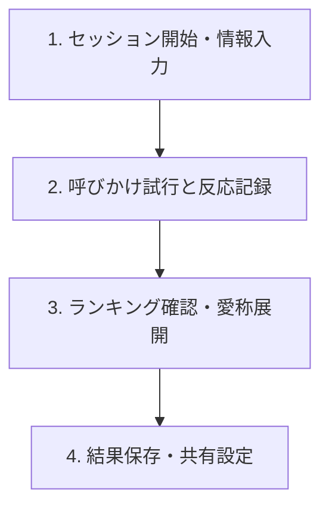

# Orpheus Echo 操作説明書 (User Guide)

本説明書は、迷い犬・迷い猫の推定呼称探索支援アプリ「Orpheus Echo」の基本操作、各画面における設定パラメータ、および機能の詳細について説明します。

---

## 1. アプリの目的と重要なお知らせ

### 目的
本アプリは、保護された犬や猫に対して一般的な名前候補を音声再生し、それに対する対象動物の反応ログ（手動記録とAI推定動作マーカー）を記録・解析することで、**「反応の強かった有力な呼称候補」**の絞り込みを支援する補助ツールです。

> [!WARNING]
> **重要事項**
> 本システムは名前の確定や特定を保証するものではありません。アプリ内で提示される数値や結果はすべて**「参考スコア」**および**「推定呼称候補」**であり、対象動物の元々の名前を「特定・正解判定」するものではない点にご留意の上、補助情報としてご活用ください。

---

## 2. 基本的な探索ワークフロー

探索セッションは以下の4つのステップで進行します。

### ステップ1: セッションの開始と個体情報の入力
1. アプリを起動し、ホーム画面から **「新規探索セッション」** を選択します。
2. 対象の動物種別（**「犬 (Dog)」** または **「猫 (Cat)」**）を選択します。
3. 個体情報の入力画面で、以下のパラメータを入力します（すべての項目は任意です）。

#### 📝 設定パラメータ（個体情報）
| パラメータ名 | 説明 | 入力例 |
| :--- | :--- | :--- |
| **仮個体ID** | 保護された現場や施設での識別用ID。他の個体と混同しないために設定します。 | `DOG-TMP-102` |
| **保護・発見場所** | 個体が発見された大まかな地域や場所を示すテキスト。 | `那覇市首里` |
| **毛色** | 個体の体毛パターンや配色。 | `茶白`、`黒キジ` |
| **年齢ヒント** | 個体の発達段階や推定される年齢層。 | `子犬`、`成猫`、`シニア` |
| **特徴・備考メモ** | 性格の傾向や首輪の有無、身体的な特徴などの自由記述。 | `赤い首輪あり、おとなしい` |

4. 入力後、画面最下部の **「探索を開始する」** ボタンをタップします。

---

### ステップ2: 呼びかけ試行（探索実行）とAI解析

探索画面では、データベースに登録された一般的な名前候補が順に提示されます。

*図1: 探索実行およびAI特徴量推定フィードバック画面*

1. **音声の再生**: 画面中央の **「音声を再生」** ボタンをタップすると、TTS（合成音声）によって名前候補が呼びかけ再生されます。
2. **反応の入力**: 呼びかけ時の動物の様子を観察し、画面下部の3つの反応ボタンから最も近いものを選択します。
   - **No Reaction (反応なし)**
   - **Weak Reaction (反応弱い)**
   - **Reaction Detected (反応あり)**
3. **推定動作マーカー (AI解析値) の表示**:
   反応ボタンをタップした直後、カメラ映像解析（シミュレーション）に基づく以下の推定パラメータが、カード中央下部のパネルにリアルタイムに表示されます。

#### 📊 推定動作マーカー（AI解析値）の各パラメータ説明
| パラメータ名 | 測定範囲 | 説明と評価ウェイト（Heuristics） |
| :--- | :--- | :--- |
| **視線移動 (Gaze Shift)** | `0.00 〜 1.00` | 呼びかけ音声（スピーカー）や呼びかけ人に向け、どれだけ素早く視線を動かしたかの測定値。 **[評価ウェイト: 大 (35%)]** 名前認識に強く寄与します。 |
| **頭の回転 (Head Turn)** | `0.00 〜 1.00` | 呼びかけに対して頭をスピーカー方向に向ける動作の正確さと強度。 **[評価ウェイト: 大 (35%)]** 反応の有無を判定する上で最も重要なマーカーです。 |
| **耳の動き (Ear Motion)** | `0.00 〜 1.00` | 音の方向に対する耳のピクつきや向きの微細な変化。 **[評価ウェイト: 中 (15%)]** 補助的な関心のシグナルとして評価されます。 |
| **接近度 (Approach)** | `0.00 〜 1.00` | 呼びかけに応じて、対象動物が物理的に呼びかけ側へ歩み寄ってきたかの距離変化。 **[評価ウェイト: 中 (15%)]** 警戒心の緩和や強い反応を示します。 |

---

### ステップ3: 呼称候補ランキングの確認と愛称展開

すべての名前候補への呼びかけが終わると、自動的にランキング画面に遷移します。

*図2: 呼称候補ランキング画面*

1. **参考スコア順のランキング**:
   - 手動による反応判定（40%）と、AI推定動作マーカーの加重平均値（60%）をブレンドした **「参考スコア」**（`0.00 〜 0.99`）の降順で呼称候補が表示されます。
2. **信頼性フラグ（Uncertainty Flag）**:
   - 候補名の右隣に ❓（疑問符）マークが表示されている場合、該当候補に対する試行回数（呼びかけ回数）が2回未満であることを示します。データの十分性を満たさないため、推定スコアの不確実性が高い状態です。精度を高めるためには再試行を推奨します。
3. **愛称・近似候補の展開**:
   - 反応が強かった上位の候補名（例: 「モモ」）をベースに、愛称やバリエーション（例: 「モモちゃん」）を自動的に展開して追加の探索候補リストに追加します。

---

### ステップ4: セッションのクローズとエクスポート
1. ランキング確認後、**「セッションを保存して詳細へ」** をタップして結果詳細画面へ進みます。
2. **共有データのオプトイン（プライバシー制御）**:
   - **「探索レポートを共有・出力」** をタップすると、外部共有用のオプトイン設定シートが表示されます。
   - **位置情報**、**メディア（動画・音声）**、**個体備考メモ** を共有レポートに含めるかを明示的に選択（オプトイン）します。チェックしなかったプライバシー情報は自動的にマスクされます。
3. **「ホームに戻る」** をタップすると、セッションがクローズ（`closed`）ステータスで保存され完了します。

---

## 3. 設定 (Settings) と詳細パラメータの説明

設定画面では、探索の挙動や各種デバイス連携のパラメータを微調整できます。

*図3: アプリ設定画面*

#### ⚙️ 音声および権限等の設定パラメータ説明
| パラメータ名 | 設定値範囲 / 状態 | 説明 |
| :--- | :--- | :--- |
| **TTS音量 (Volume)** | `0% 〜 100%` (初期値 80%) | 呼びかけ音声（TTS）のボリュームレベル。風切音などの環境ノイズが大きい野外では高めに設定します。 |
| **再生速度 (Playback Rate)** | `0.5x 〜 2.0x` (初期値 1.0x) | 呼びかける発話スピード。対象動物の聴覚・反応特性に合わせて微調整します（通常は1.0xが推奨されます）。 |
| **カメラプレビューの利用 (Camera Access)** | `オン (ON) / オフ (OFF)` | 推定動作マーカーを測定するために、カメラプレビューの利用権限を許可します。 |
| **位置情報サービスの利用 (Location Services)** | `オン (ON) / オフ (OFF)` | セッションの開始位置を自動で記録するかの許可トグル。 **[プライバシー保護のためデフォルトはOFF]** です。 |
| **オフライン動作モード (Offline Mode)** | `オン (ON) / オフ (OFF)` | 電波の届かない現場での探索や、サーバーへの即時送信をせずローカルでデータを蓄積したい場合にONに設定します。接続再開時に一括同期が可能です。 |
