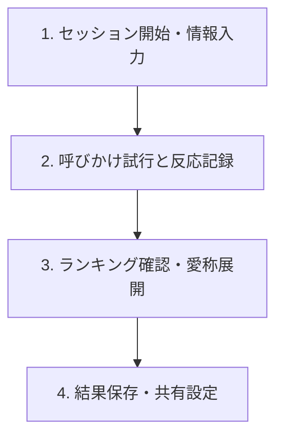

# Orpheus Echo 操作説明書 (User Guide)

本説明書は、迷い犬・迷い猫の推定呼称探索支援アプリ「Orpheus Echo」の基本操作および機能について説明します。

---

## 1. アプリの目的と重要なお知らせ

### 目的
本アプリは、保護された犬や猫に対して一般的な名前候補を音声再生し、それに対する対象動物の反応ログを記録・解析することで、**「反応の強かった有力な呼称候補」**の絞り込みを支援する補助ツールです。

> [!WARNING]
> **重要事項**
> 本システムは名前の確定や特定を保証するものではありません。アプリ内で提示される数値や結果はすべて**「参考スコア」**および**「推定呼称候補」**であり、対象動物の元々の名前を「特定・正解判定」するものではない点にご留意の上、補助情報としてご活用ください。

---

## 2. 基本的な探索ワークフロー

探索セッションは以下の4つのステップで進行します。

### ステップ1: セッションの開始と個体情報の入力
1. アプリを起動し、ホーム画面から **「新規探索セッション」** を選択します。
2. 対象の動物種別（**「犬 (Dog)」** または **「猫 (Cat)」**）を選択します。
3. 個体情報の入力画面で、以下の情報を入力します（すべての項目は任意です）。
   - **仮個体ID**: 現場やシェルターでの管理用ID（例: `DOG-TMP-001`）
   - **保護場所・発見場所**: 発見された位置情報（例: `那覇市首里`）
   - **毛色**: 動物の体色（例: `茶白`）
   - **年齢ヒント**: 大まかな年齢層（例: `子犬`、`成猫`）
   - **特徴・備考メモ**: 性格や首輪の有無などの自由記述
4. 入力後、画面最下部の **「探索を開始する」** ボタンをタップします。

---

### ステップ2: 呼びかけ試行（探索実行）とAI解析
探索画面では、データベースに登録された一般的な名前候補が順に提示されます。

1. **音声の再生**: 画面中央の **「音声を再生」** ボタンをタップすると、TTS（合成音声）によって名前候補が呼びかけ再生されます。
2. **反応の入力**: 呼びかけ時の動物の様子を観察し、画面下部の3つの反応ボタンから最も近いものを選択します。
   - **反応あり**: 明らかに振り向いた、耳を動かした、近寄ってきたなど
   - **反応弱い**: 少し耳がピクッとした、一瞬視線を向けたなど
   - **反応なし**: 全く無反応、または無視されたなど
3. **AI推定動作マーカー**:
   - 反応を記録した直後、カメラ映像解析（シミュレーション）による **「推定動作マーカー（AI解析値）」** がカード下部に表示されます。
   - 表示項目：**視線移動 (Gaze Shift)**、**頭の回転 (Head Turn)**、**耳の動き (Ear Motion)**、**接近度 (Approach)**
   - これらのパラメータは、バックエンドで「参考スコア」を算出する際の加重特徴量（Heuristics）として使用されます。
4. すべての名前候補への呼びかけが終わるか、**「探索を完了して結果を見る」** ボタンをタップすると次のステップに進みます。

---

### ステップ3: 呼称候補ランキングの確認と愛称展開
1. これまでの手動反応ログおよびAI特徴量に基づき、反応の強かった呼称候補が **「参考スコア」**（0.00〜0.99）の降順でランキング表示されます。
2. **信頼性フラグ（Uncertainty Flag）**:
   - 候補名の右隣に ❓ マークが表示されている場合、その候補に対する試行回数（呼びかけ回数）が不足しているため、推定スコアの不確実性が高いことを意味します。より正確な判定には、追加の呼びかけ試行を推奨します。
3. **愛称・近似候補の展開**:
   - 画面下部の **「上位候補から愛称・変形を展開」** ボタンをタップすると、反応の強かった上位候補名をベースにしたバリエーション（例: 「モモ」に対して「モモちゃん」など）が自動生成され、再探索リストに追加されます。

---

### ステップ4: セッションのクローズとエクスポート
1. ランキング確認後、**「セッションを保存して詳細へ」** をタップすると結果詳細画面に遷移します。
2. **データ共有のオプトイン確認**:
   - **「探索レポートを共有・出力」** をタップすると、共有データ選択シートが表示されます。
   - プライバシー保護のため、**位置情報**、**メディア（動画・音声）**、**個体備考メモ** を共有レポートに含めるかどうかをオプトイン（チェックを入れて選択）で制御できます。選択されなかった個人情報・プライバシーデータは自動的にマスクされます。
3. **AI学習データへの協力（任意）**:
   - アプリの推定精度向上のため、匿名の教師データとして探索ログを提供することへの同意トグルを配置しています（いつでも設定からオフにできます）。
4. **「ホームに戻る」** をタップすると、セッションが `closed` ステータスとして保存され、探索が完了します。

---

## 3. その他のメニュー

### 探索履歴 (History)
- ホーム画面の **「履歴を見る」** から、過去に実施したすべてのセッションの一覧を確認できます。
- クラウドへのバックアップ同期状況に応じて、**「同期済み」**（緑）または **「未同期」**（オレンジ）のステータスインジケーターが表示されます。

### 設定 (Settings)
- **音声再生 (TTS) 設定**: 呼びかけ音声の音量（Volume）や再生速度（Rate）をスライダーで微調整できます。
- **プライバシー & 権限**: カメラの利用、位置情報の利用、AI学習協力への同意状態をいつでも変更できます（位置情報サービスはデフォルトでOFFになっています）。
- **同期設定**: バックエンドサーバーへの自動接続を一時停止し、ローカルだけで完結して記録を行いたい場合は **「オフライン動作モード」** をONに設定してください。

---

## 4. オフライン環境でのご利用について

Orpheus Echo は、山間部や電波の届かない現場での探索を考慮し、**完全オフライン状態**でも動作可能です。
- インターネット未接続（あるいはサーバーが停止している）状態をアプリが検知すると、自動的にオフラインモードでセッションを開始します。
- 探索中に入力した反応ログや簡易ランキングの計算は、すべてアプリ端末内でローカルに実行・完結します。
- オンライン環境に戻った際、または設定画面の **「即時同期を試行」** をタップすることで、未同期のセッション履歴が一括してクラウドへ安全にバックアップ同期されます。
