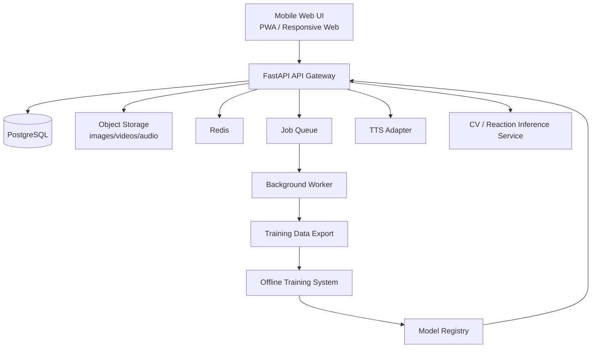

# 迷い犬・迷い猫の推定呼称探索支援アプリ  
# API仕様書付き・FastAPI実装設計版（モバイルWebインターフェイス前提）

- 文書名: 迷い犬・迷い猫の推定呼称探索支援アプリ API仕様書付き・FastAPI実装設計版
- 版数: 1.1
- 作成日: 2026-04-08
- 前提: 既存の完成版要件定義書 v1.0 を実装設計レベルへ展開した版
- 想定利用端末: スマートフォン中心（iPhone / Android のモバイルブラウザ）
- 想定アーキテクチャ: FastAPI + PostgreSQL + Object Storage + バッチ学習基盤 + モバイルWeb UI

---

## 1. 目的

本書は、完成版要件定義書をもとに、以下を実装可能な粒度まで具体化することを目的とする。

- モバイルWebインターフェイス前提の画面設計
- FastAPI ベースのバックエンド構成
- REST API 仕様
- 非同期処理・学習連携方針
- データモデル設計
- ディレクトリ構成
- 実装上の責務分離

---

## 2. 全体アーキテクチャ



### 2.1 コンポーネント概要

| コンポーネント | 役割 |
|---|---|
| Mobile Web UI | 現場利用用フロント。スマホ1画面で主要操作が完結する |
| FastAPI API | 認証、業務ロジック、セッション管理、候補探索、結果返却 |
| PostgreSQL | 業務データ保存 |
| Object Storage | 画像、音声、動画、学習素材保存 |
| Redis | キャッシュ、レート制御、短期セッション、ジョブ制御補助 |
| Worker | 重い解析、エクスポート、集計処理 |
| TTS Adapter | 多言語音声合成接続 |
| CV / Reaction Inference Service | 表情・視線・姿勢・反応スコア推定 |
| Offline Training System | 学習データ集約とバッチ再学習 |
| Model Registry | 推論モデルのバージョン管理と配布 |

---

## 3. モバイルWeb UI設計方針

## 3.1 UI基本方針
- 片手操作を基本とする
- 主要操作は親指到達範囲の下部固定アクションバーに集約する
- 現場では手早い操作が重要なため、入力項目は最小化する
- カメラプレビューを最大表示し、解析状態はオーバーレイ表示する
- 音声再生操作は大きなボタン1〜3個に絞る
- ネットワーク不安定を想定し、送信状態を明示する
- PWA 前提で、ホーム画面追加・一部オフライン対応を想定する

## 3.2 レスポンシブ設計
- 最小幅: 360px
- 基準幅: 390px〜430px
- 縦持ち優先
- 横持ちは詳細レビュー画面のみ補助対応
- タブレットでは2カラムを許可
- デスクトップは管理画面・辞書管理画面で利用しやすい拡張レイアウト

## 3.3 画面構成原則
- ヘッダー: 最小限（戻る、画面名、状態）
- メイン: カメラ/候補/結果
- フッター固定: 主要アクション
- モーダル: 詳細設定、候補比較、辞書切替
- トースト: 保存成功、送信待ち、解析中など

---

## 4. モバイルWeb画面詳細

## 4.1 ホーム画面
**目的**  
主要機能への入口を提供する。

**主要UI**
- 「迷い犬・迷い猫を探す」
- 「既知名データを登録」
- 「ジョークモード」
- 「履歴」
- 「設定」

**スマホUI案**
- 縦並びの大きいカードボタン
- 最近のセッションを下部に表示

---

## 4.2 種別選択画面
**目的**  
犬・猫の選択を行う。

**主要UI**
- 犬ボタン
- 猫ボタン
- 国・言語の簡易選択リンク
- 詳細設定へ進むリンク

**モバイル配慮**
- 犬/猫ボタンを画面の大部分に配置
- タップ誤操作防止のため最低高さ 64px 以上

---

## 4.3 個体情報入力画面
**目的**  
探索前の最低限属性を設定する。

**入力項目**
- 仮ID
- 保護場所
- 毛色
- 年齢感（任意）
- 備考
- 国
- 言語
- 多国籍候補モード ON/OFF

**モバイル配慮**
- テキスト入力は最少
- 選択式を優先
- 1画面で完結、スクロールを短くする

---

## 4.4 探索実行画面
**目的**  
カメラを見ながら名前候補を順次再生し、反応を観察する。

**主要UI**
- 全画面カメラプレビュー
- 上部: セッション情報、オンライン/オフライン状態
- 下部オーバーレイ:
  - 再生開始
  - 一時停止
  - 次候補
  - モジュレーション切替
  - 反応あり
  - 反応なし
  - 保存
- 中央オーバーレイ:
  - 現在の候補名
  - 音声種別
  - 反応スコア速報
- スワイプ:
  - 左右で候補送り
  - 上スワイプで候補詳細
  - 下スワイプで簡易設定

**モバイル配慮**
- 重要ボタンは下部固定
- カメラ占有率を高くする
- 片手操作で「再生」「次」「反応あり」が届く配置にする

---

## 4.5 候補絞り込み画面
**目的**  
反応の高かった候補を比較し、再試行対象を選ぶ。

**主要UI**
- 上位候補カード一覧
- 反応スコアバー
- 音節類似候補の自動提案
- 「再試行に追加」
- 「候補から除外」
- 「最終候補へ進む」

**モバイル配慮**
- 1カード1候補
- 横スワイプ比較対応
- バッジで「高反応」「再現性高」を表示

---

## 4.6 セッション結果画面
**目的**  
最終候補と記録を表示し、共有・保存する。

**主要UI**
- 上位候補ランキング
- 反応サマリ
- 動画サムネイル
- CSV/PDF/JSON出力
- 学習用データに含める/含めない
- 共有リンク生成（管理者向け）

---

## 4.7 既知名個体登録画面
**目的**  
教師データ用の既知名個体を登録する。

**主要UI**
- 名前
- 愛称
- 種別
- 画像追加
- 同意確認チェック
- 保存

**モバイル配慮**
- フォーム項目をステップ分割
- カメラ撮影を即起動できるボタン

---

## 4.8 学習収集セッション画面
**目的**  
飼い主が実際に呼びかけ、正例/負例を収集する。

**主要UI**
- 現在呼ぶ名称
- 正名 / 誤名 ラベル
- 録画開始 / 停止
- 次の呼称へ
- 話者種別
- 環境メモ
- セッション完了

**モバイル配慮**
- 収集フローをウィザード形式にする
- 呼称ごとに大きな録画ボタンを配置

---

## 4.9 国・言語選択画面
**目的**  
辞書、TTS、UI言語の選択を行う。

**主要UI**
- 国選択
- 言語選択
- UI言語
- 音声言語
- 地域アクセント
- おすすめ辞書表示

---

## 4.10 ジョークモード画面群
**目的**  
人間向けの雰囲気名前候補・ニックネーム候補を提示する。

**主要UI**
- 人物画像アップロード/撮影
- 国・言語選択
- 年代カテゴリ選択
- フォーマル/カジュアル
- 候補再生
- 「ウケた」手動ボタン
- 結果カード保存

**注意表示**
- 実名推定ではない
- 属性断定を行わない
- 娯楽機能である

---

## 5. フロントエンド技術方針

## 5.1 推奨技術
- Next.js または React + Vite
- TypeScript
- Tailwind CSS
- PWA 対応
- Zustand or Redux Toolkit
- React Query / TanStack Query
- MediaDevices API（カメラ、マイク）
- Service Worker（オフラインキュー）

## 5.2 フロントエンド責務
- UI描画
- 一時入力保持
- カメラ/マイク制御
- API通信
- オフライン再送制御
- 一部軽量前処理
- TTSプレビュー再生
- 候補比較操作

---

## 6. FastAPIバックエンド設計方針

## 6.1 API層責務
- 認証・認可
- リクエスト検証
- 業務ユースケース実行
- DB更新
- 非同期ジョブ投入
- ファイルアップロードURL発行
- レスポンス整形

## 6.2 サービス層責務
- セッションライフサイクル管理
- 候補生成・絞り込み
- 学習データ生成
- 国別辞書解決
- ジョーク候補生成
- モデルバージョン制御

## 6.3 非同期化対象
- 動画解析
- 音声解析
- 反応スコア再計算
- PDF生成
- 学習データエクスポート
- モデル同期確認
- バッチ集計

---

## 7. FastAPIディレクトリ構成

```text
backend/
├─ app/
│  ├─ main.py
│  ├─ core/
│  │  ├─ config.py
│  │  ├─ security.py
│  │  ├─ logging.py
│  │  ├─ database.py
│  │  ├─ cache.py
│  │  └─ exceptions.py
│  ├─ api/
│  │  ├─ deps.py
│  │  ├─ router.py
│  │  └─ v1/
│  │     ├─ auth.py
│  │     ├─ sessions.py
│  │     ├─ candidates.py
│  │     ├─ trials.py
│  │     ├─ results.py
│  │     ├─ known_animals.py
│  │     ├─ images.py
│  │     ├─ training_sessions.py
│  │     ├─ training_data.py
│  │     ├─ models.py
│  │     ├─ countries.py
│  │     ├─ tts.py
│  │     ├─ joke_sessions.py
│  │     ├─ uploads.py
│  │     └─ health.py
│  ├─ schemas/
│  │  ├─ common.py
│  │  ├─ auth.py
│  │  ├─ session.py
│  │  ├─ candidate.py
│  │  ├─ trial.py
│  │  ├─ result.py
│  │  ├─ known_animal.py
│  │  ├─ image.py
│  │  ├─ training.py
│  │  ├─ model.py
│  │  ├─ country.py
│  │  ├─ tts.py
│  │  └─ joke.py
│  ├─ models/
│  │  ├─ base.py
│  │  ├─ session.py
│  │  ├─ candidate.py
│  │  ├─ trial.py
│  │  ├─ reaction_feature.py
│  │  ├─ known_animal.py
│  │  ├─ owner_profile.py
│  │  ├─ image_annotation.py
│  │  ├─ training_session.py
│  │  ├─ training_trial.py
│  │  ├─ model_version.py
│  │  ├─ country_name_dictionary.py
│  │  ├─ tts_profile.py
│  │  ├─ joke_name_profile.py
│  │  ├─ joke_session.py
│  │  └─ joke_reaction_log.py
│  ├─ repositories/
│  │  ├─ session_repository.py
│  │  ├─ candidate_repository.py
│  │  ├─ trial_repository.py
│  │  ├─ known_animal_repository.py
│  │  ├─ training_repository.py
│  │  ├─ country_repository.py
│  │  ├─ tts_repository.py
│  │  ├─ joke_repository.py
│  │  └─ model_repository.py
│  ├─ services/
│  │  ├─ session_service.py
│  │  ├─ candidate_service.py
│  │  ├─ reaction_service.py
│  │  ├─ ranking_service.py
│  │  ├─ known_animal_service.py
│  │  ├─ training_service.py
│  │  ├─ export_service.py
│  │  ├─ country_dictionary_service.py
│  │  ├─ tts_service.py
│  │  ├─ joke_service.py
│  │  ├─ upload_service.py
│  │  └─ model_service.py
│  ├─ domain/
│  │  ├─ candidate_generation.py
│  │  ├─ phonetic_rules.py
│  │  ├─ country_rules.py
│  │  ├─ reaction_scoring.py
│  │  ├─ training_labeling.py
│  │  └─ joke_guardrails.py
│  ├─ workers/
│  │  ├─ queue.py
│  │  ├─ tasks_reaction.py
│  │  ├─ tasks_export.py
│  │  ├─ tasks_report.py
│  │  ├─ tasks_model_sync.py
│  │  └─ tasks_cleanup.py
│  ├─ integrations/
│  │  ├─ object_storage.py
│  │  ├─ tts_adapter.py
│  │  ├─ cv_inference_client.py
│  │  ├─ training_sync_client.py
│  │  └─ model_registry_client.py
│  ├─ utils/
│  │  ├─ time.py
│  │  ├─ ids.py
│  │  ├─ pagination.py
│  │  └─ filehash.py
│  └─ tests/
│     ├─ conftest.py
│     ├─ api/
│     ├─ services/
│     ├─ domain/
│     └─ integration/
├─ alembic/
├─ scripts/
│  ├─ seed_country_dictionaries.py
│  ├─ seed_tts_profiles.py
│  └─ seed_joke_profiles.py
├─ docker/
│  ├─ Dockerfile.api
│  ├─ Dockerfile.worker
│  └─ Dockerfile.nginx
├─ docker-compose.yml
├─ pyproject.toml
└─ README.md
```

---

## 8. バックエンド層の責務分離

### 8.1 router
HTTP入出力、認証、ステータスコード、OpenAPIへの露出だけを担当する。

### 8.2 service
ユースケースを構成する。複数 repository や domain を組み合わせる。

### 8.3 repository
DBとの永続化処理を担当する。

### 8.4 domain
純粋な業務ルールを担当する。  
例:
- 音節類似候補生成
- 国別愛称ルール
- 反応スコア計算
- ジョーク候補の安全フィルタ

### 8.5 integration
外部サービス接続。  
例:
- TTS
- Object Storage
- 推論エンジン
- モデルレジストリ

---

## 9. API共通仕様

## 9.1 認証
- 方式: Bearer Token / JWT
- モバイルWebはログインセッションまたはトークン保持
- 管理者APIはロール制御

## 9.2 共通レスポンス
```json
{
  "data": {},
  "meta": {
    "request_id": "req_123",
    "timestamp": "2026-04-08T12:00:00Z"
  },
  "error": null
}
```

エラー時:
```json
{
  "data": null,
  "meta": {
    "request_id": "req_123",
    "timestamp": "2026-04-08T12:00:00Z"
  },
  "error": {
    "code": "VALIDATION_ERROR",
    "message": "species is required"
  }
}
```

## 9.3 ページング
```json
{
  "data": [],
  "meta": {
    "page": 1,
    "page_size": 20,
    "total": 120
  },
  "error": null
}
```

---

## 10. API仕様

## 10.1 セッションAPI

### POST /api/v1/sessions
新規探索セッションを作成する。

**Request**
```json
{
  "species": "dog",
  "temp_animal_id": "DOG-TMP-001",
  "location_text": "那覇市",
  "coat_color": "brown",
  "age_hint": "adult",
  "country_code": "JP",
  "language_code": "ja-JP",
  "multi_country_mode": false,
  "notes": "首輪なし"
}
```

**Response**
```json
{
  "data": {
    "session_id": "ses_001",
    "status": "created"
  },
  "meta": {
    "request_id": "req_001",
    "timestamp": "2026-04-08T12:00:00Z"
  },
  "error": null
}
```

### GET /api/v1/sessions/{session_id}
セッション詳細を取得する。

### PATCH /api/v1/sessions/{session_id}
セッション属性を更新する。

### POST /api/v1/sessions/{session_id}/close
セッションを終了する。

---

## 10.2 候補API

### GET /api/v1/candidates
候補一覧取得。

**Query**
- species=dog|cat
- country_code=JP
- language_code=ja-JP
- q=モ
- page=1
- page_size=20

### POST /api/v1/candidates
候補を登録する。

### PATCH /api/v1/candidates/{candidate_id}
候補を更新する。

### DELETE /api/v1/candidates/{candidate_id}
候補を無効化する。

---

## 10.3 試行API

### POST /api/v1/sessions/{session_id}/trials
呼称試行を記録する。

**Request**
```json
{
  "candidate_id": "cand_001",
  "variant_text": "モモちゃん",
  "voice_type": "female_bright",
  "modulation_type": "nickname",
  "played_at": "2026-04-08T12:10:00Z",
  "manual_flag": "reaction_yes"
}
```

**Response**
```json
{
  "data": {
    "trial_id": "trl_001",
    "status": "accepted_for_scoring"
  },
  "meta": {
    "request_id": "req_002",
    "timestamp": "2026-04-08T12:10:01Z"
  },
  "error": null
}
```

### POST /api/v1/sessions/{session_id}/trials/{trial_id}/features
解析特徴量を保存する。

**Request**
```json
{
  "gaze_shift_score": 0.82,
  "ear_motion_score": 0.65,
  "head_turn_score": 0.77,
  "posture_change_score": 0.33,
  "approach_score": 0.12,
  "vocalization_score": 0.08,
  "repeatability_score": 0.71
}
```

---

## 10.4 ランキングAPI

### POST /api/v1/sessions/{session_id}/rank
候補ランキングを再計算する。

**Response**
```json
{
  "data": {
    "top_candidates": [
      {"candidate_id": "cand_001", "name": "モモ", "score": 0.91},
      {"candidate_id": "cand_008", "name": "モカ", "score": 0.74}
    ]
  },
  "meta": {
    "request_id": "req_003",
    "timestamp": "2026-04-08T12:15:00Z"
  },
  "error": null
}
```

### POST /api/v1/sessions/{session_id}/refine
上位候補を元に再探索候補を生成する。

---

## 10.5 結果API

### GET /api/v1/sessions/{session_id}/results
結果詳細を返す。

### GET /api/v1/sessions/{session_id}/export?format=pdf
PDF出力ジョブを作成し、ダウンロードURLを返す。

### GET /api/v1/sessions/{session_id}/export?format=csv
CSV出力。

### GET /api/v1/sessions/{session_id}/export?format=json
JSON出力。

---

## 10.6 既知名個体API

### POST /api/v1/known-animals
既知名個体を登録する。

**Request**
```json
{
  "species": "cat",
  "true_name": "ルナ",
  "aliases": ["ルー", "ルナちゃん"],
  "sex": "female",
  "age_range": "adult",
  "breed": "mixed",
  "coat_color": "black",
  "owner_consent_status": "agreed"
}
```

### GET /api/v1/known-animals/{known_animal_id}
詳細取得。

### PATCH /api/v1/known-animals/{known_animal_id}
更新。

### POST /api/v1/known-animals/{known_animal_id}/aliases
愛称追加。

---

## 10.7 画像API

### POST /api/v1/known-animals/{known_animal_id}/images
アップロード対象画像メタデータを登録する。

**Request**
```json
{
  "file_name": "cat1.jpg",
  "content_type": "image/jpeg",
  "pose_type": "front",
  "image_quality": "good"
}
```

**Response**
```json
{
  "data": {
    "image_id": "img_001",
    "upload_url": "https://example-upload-url"
  },
  "meta": {
    "request_id": "req_004",
    "timestamp": "2026-04-08T12:20:00Z"
  },
  "error": null
}
```

### PATCH /api/v1/images/{image_id}/annotations
アノテーション更新。

---

## 10.8 学習収集API

### POST /api/v1/training-sessions
学習収集セッション作成。

**Request**
```json
{
  "known_animal_id": "ka_001",
  "speaker_type": "owner",
  "environment_type": "indoor",
  "purpose": "positive_negative_collection"
}
```

### POST /api/v1/training-sessions/{training_session_id}/trials
学習試行追加。

**Request**
```json
{
  "called_name": "ルナ",
  "is_true_name": true,
  "is_alias": false,
  "modulation_type": "normal",
  "playback_source": "owner_live_voice"
}
```

### POST /api/v1/training-sessions/{training_session_id}/complete
セッション完了。

---

## 10.9 学習データ同期API

### POST /api/v1/training-data/export
学習データをエクスポートキューに投入。

**Request**
```json
{
  "session_ids": ["ses_001", "ses_002"],
  "training_session_ids": ["trs_001"],
  "anonymize": true
}
```

### POST /api/v1/training-data/sync
外部学習システムへ同期開始。

### GET /api/v1/training-data/sync-status/{job_id}
ジョブ状況確認。

---

## 10.10 モデルAPI

### GET /api/v1/models/current
現在のモデル情報取得。

### GET /api/v1/models/versions
配布可能モデル一覧取得。

### POST /api/v1/models/check-update
更新可否を確認。

### POST /api/v1/models/apply-update
更新予約または反映。

---

## 10.11 国際化辞書API

### GET /api/v1/countries
対応国一覧。

### GET /api/v1/languages
対応言語一覧。

### GET /api/v1/country-dictionaries
国別辞書を検索。

**Query**
- country=JP
- language=ja-JP
- species=dog
- category=popular

### POST /api/v1/country-dictionaries
辞書項目登録。

---

## 10.12 TTS API

### GET /api/v1/tts/profiles
TTSプロファイル一覧。

### POST /api/v1/tts/preview
候補音声プレビュー生成。

**Request**
```json
{
  "text": "モモちゃん",
  "language_code": "ja-JP",
  "locale_code": "ja-JP",
  "voice_type": "female_bright",
  "speaking_rate": 1.0,
  "pitch": 0.2
}
```

**Response**
```json
{
  "data": {
    "audio_url": "https://example-audio-url"
  },
  "meta": {
    "request_id": "req_005",
    "timestamp": "2026-04-08T12:25:00Z"
  },
  "error": null
}
```

### POST /api/v1/tts/speak
本番再生用音声生成ジョブ作成。

---

## 10.13 ジョークAPI

### POST /api/v1/joke-sessions
ジョークセッション作成。

**Request**
```json
{
  "selected_country": "JP",
  "selected_language": "ja-JP",
  "selected_age_band": "30s_like",
  "tone_type": "casual"
}
```

### POST /api/v1/joke-sessions/{joke_session_id}/image
人物画像登録。

### POST /api/v1/joke-sessions/{joke_session_id}/generate-candidates
候補生成。

**Response**
```json
{
  "data": {
    "candidates": [
      {"name": "たけし", "type": "common_name"},
      {"name": "タケちゃん", "type": "nickname"},
      {"name": "部長っぽい人", "type": "joke_safe"}
    ]
  },
  "meta": {
    "request_id": "req_006",
    "timestamp": "2026-04-08T12:30:00Z"
  },
  "error": null
}
```

### POST /api/v1/joke-sessions/{joke_session_id}/reactions
ウケ反応記録。

### GET /api/v1/joke-sessions/{joke_session_id}/results
結果取得。

---

## 11. Pydanticスキーマ設計方針

- Request/Response を明確に分離
- Base, Create, Update, Read を分割
- APIの後方互換性維持のため optional 管理を厳格化
- ORMモデルと直接結合させず schema 層で境界を持つ

例:

```python
class SessionCreate(BaseModel):
    species: Literal["dog", "cat"]
    temp_animal_id: str | None = None
    location_text: str | None = None
    country_code: str | None = None
    language_code: str | None = None
    multi_country_mode: bool = False
    notes: str | None = None

class SessionRead(BaseModel):
    session_id: str
    species: str
    status: str
    created_at: datetime
```

---

## 12. SQLAlchemyモデル設計方針

- UUID系IDまたはアプリ側生成IDを採用
- created_at / updated_at を共通Mixinで保持
- 論理削除が必要なものは deleted_at を持つ
- ENUM は将来追加を考え text + domain validation でも可
- メディアファイル本体はDBに持たずURL/Keyのみ保持

---

## 13. 非同期ジョブ設計

## 13.1 ジョブ種別
- reaction_score_recalc
- session_export_pdf
- session_export_csv
- training_export
- model_update_check
- stale_upload_cleanup
- dictionary_seed_sync

## 13.2 ジョブ状態
- queued
- running
- succeeded
- failed
- canceled

## 13.3 推奨実装
- Celery + Redis
- RQ + Redis
- Dramatiq
- もしくは軽量構成なら FastAPI + arq

---

## 14. ストレージ設計

## 14.1 保存先
- PostgreSQL: 構造化データ
- Object Storage: 画像、音声、動画、PDF
- Redis: 一時状態、レート制御、ジョブキュー

## 14.2 メディア命名規則
```text
sessions/{session_id}/videos/{file_id}.mp4
sessions/{session_id}/audio/{file_id}.m4a
known_animals/{known_animal_id}/images/{file_id}.jpg
training_sessions/{training_session_id}/videos/{file_id}.mp4
joke_sessions/{joke_session_id}/images/{file_id}.jpg
exports/{session_id}/result_{timestamp}.pdf
```

---

## 15. docker-compose構成例

```yaml
version: "3.9"

services:
  api:
    build:
      context: .
      dockerfile: docker/Dockerfile.api
    command: uvicorn app.main:app --host 0.0.0.0 --port 8000
    env_file:
      - .env
    ports:
      - "8000:8000"
    depends_on:
      - db
      - redis

  worker:
    build:
      context: .
      dockerfile: docker/Dockerfile.worker
    command: celery -A app.workers.queue worker --loglevel=info
    env_file:
      - .env
    depends_on:
      - db
      - redis

  db:
    image: postgres:16
    environment:
      POSTGRES_DB: animal_name_app
      POSTGRES_USER: animal_user
      POSTGRES_PASSWORD: animal_pass
    ports:
      - "5432:5432"
    volumes:
      - postgres_data:/var/lib/postgresql/data

  redis:
    image: redis:7
    ports:
      - "6379:6379"

volumes:
  postgres_data:
```

---

## 16. 実装優先順位

## Phase 1: MVP
- 犬/猫選択
- セッション作成
- 候補辞書読込
- TTS再生
- 手動反応記録
- 上位候補表示
- モバイル画面最適化

## Phase 2: 解析強化
- カメラ映像反応解析
- 試行ごとの特徴保存
- 候補絞り込み自動化
- CSV/PDF出力

## Phase 3: 学習基盤
- 既知名個体登録
- 正例/負例収集
- 学習データ同期
- モデル更新連携

## Phase 4: 国際化
- 国別辞書
- 多言語TTS
- UI多言語化
- 愛称ルール差し替え

## Phase 5: ジョーク機能
- 画像入力
- 雰囲気候補生成
- ウケ反応記録
- 結果カード生成

---

## 17. セキュリティ・安全設計

- JWT認証
- ロールベース権限制御
- 署名付きアップロードURL
- 個人情報と業務データの分離
- 人間画像の短期保持オプション
- ジョーク機能での禁止候補フィルタ
- 属性推定禁止ルールを domain/joke_guardrails.py に集中定義
- ログに画像URLや個人名を不用意に出さない

---

## 18. テスト方針

## 18.1 単体テスト
- 候補生成
- 愛称生成
- 国別辞書解決
- 反応スコアリング
- ジョーク候補安全フィルタ

## 18.2 APIテスト
- 正常系
- バリデーションエラー
- 認証エラー
- ページング
- 非同期ジョブ起票

## 18.3 E2Eテスト
- スマホ画面でセッション作成から結果表示まで
- 既知名個体登録から学習セッション完了まで
- ジョークモード起動から結果取得まで

## 18.4 実機テスト観点
- iPhone Safari
- Android Chrome
- カメラ権限
- 音声再生制約
- PWA挙動
- オフライン再送

---

## 19. 開発時の設計上の注意

- まずは「解析なしでも成立するUI/業務フロー」を作る
- CV解析や高度スコアは後から差し替え可能な設計にする
- TTS、CV、学習同期は adapter 経由で疎結合にする
- モバイル回線を前提にメディアアップロードを再開可能設計にする
- ジョーク機能は本体機能のテーブルやユースケースと極力分離する

---

## 20. まとめ

本実装設計版では、完成版要件定義書をもとに、スマートフォンでの現場利用を前提としたモバイルWeb UI、FastAPI を中心とするバックエンド構成、REST API仕様、非同期ジョブ、学習連携、国際化、ジョーク機能まで含めた実装方針を定義した。

特に重要な設計原則は次のとおりである。

1. **現場利用ではモバイルWebを最優先**  
2. **FastAPI 側は責務分離を厳密にする**  
3. **重い解析と学習は別システムまたは非同期処理へ逃がす**  
4. **国際化辞書とジョーク辞書は設定追加で拡張可能にする**  
5. **安全性・プライバシー・不確実性表示を仕様レベルで担保する**

この構成により、まずはMVPを短期間で構築し、段階的に反応解析・学習・国際化・ジョーク機能を拡張できる。
