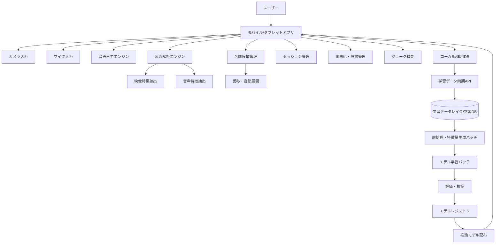
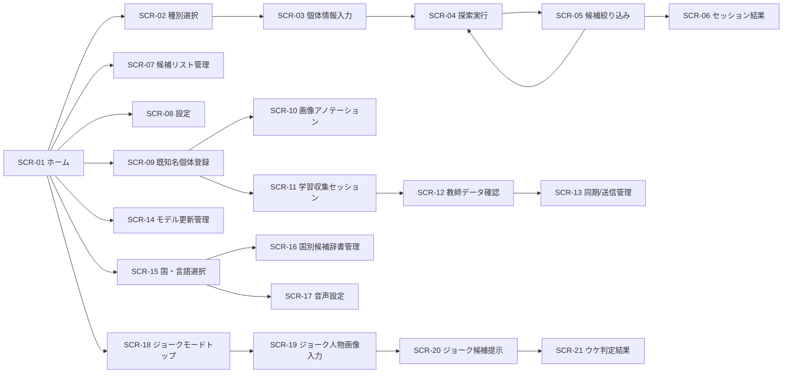
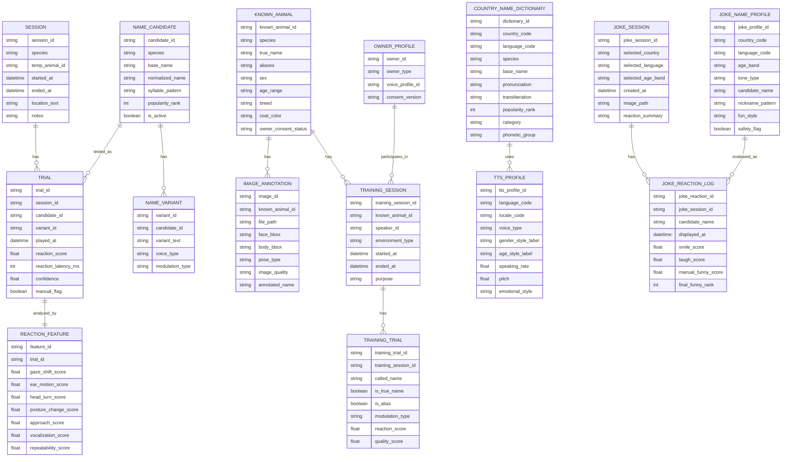
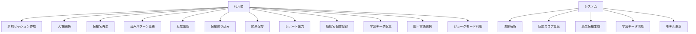

# 迷い犬・迷い猫の推定呼称探索支援アプリ 要件定義書（完成版）

- 文書名: 迷い犬・迷い猫の推定呼称探索支援アプリ 要件定義書
- 版数: 1.0
- 作成日: 2026-04-08
- 作成目的:  
  保護した犬・猫、または飼い主不明の個体に対して、一般的によく使われる名前候補を音声再生し、対象動物の表情・視線・耳・体勢・接近行動・反応時間などを解析することで、元の呼称に近い名称候補の絞り込みを支援するアプリケーションの要件を整理する。あわせて、既知名個体の学習データ収集、モデル強化、国際化対応、多言語音声合成、および人間向けの安全なジョーク機能の要件を統合する。

---

## 1. 背景と目的

迷い犬・迷い猫の保護時、個体が自身の名前に反応することがある。  
一方で保護者や現場担当者は、個体の元の名前が分からないため、反応の確認が困難である。

本システムは、以下を目的とする。

1. 犬・猫別に一般的な名前候補を再生できること  
2. 男性声・女性声・愛称風など複数の呼びかけパターンを試せること  
3. カメラ映像から対象動物の反応を解析し、名前候補を段階的に絞り込めること  
4. 保護現場、動物病院、保護団体、自治体施設等で、探索作業を効率化すること  
5. 名前が既知の犬・猫から教師データを収集し、モデルを継続的に改善できること  
6. 国や言語に応じた候補名称リスト・音声合成に対応すること  
7. 娯楽目的の付加機能として、安全な人間向けジョーク機能を提供すること

本システムは**名前の確定を保証するものではなく、候補の絞り込みを支援する補助ツール**として位置づける。  
また、人間向けジョーク機能は**本人確認・属性推定・実名推定を目的としない娯楽機能**として明確に分離する。

---

## 2. 用語定義

| 用語 | 定義 |
|---|---|
| 対象個体 | 保護対象となる犬または猫 |
| 呼称候補 | 個体の名前候補として再生する名称 |
| モジュレーション | 男性声、女性声、幼い声、愛称風、抑揚変更、速度変更などの音声変化 |
| 反応スコア | 各呼称候補に対して映像・音声解析から算出する反応の強さ |
| セッション | 1個体に対して一連の呼称探索を行う単位 |
| 愛称展開 | 元の名前に接尾辞・短縮形・重ね呼びなどを付与した呼び方生成 |
| 候補絞り込み | 反応スコア上位の名称に探索対象を縮小する処理 |
| 既知名個体 | 名前が既に分かっており、教師データ収集対象として扱う犬または猫 |
| 正例 | 対象の正式名または愛称を呼んだ学習データ |
| 負例 | 対象の名前以外を呼んだ学習データ |
| 曖昧例 | 正名／誤名反応が明確に分けにくい学習データ |
| 国別辞書 | 国・言語・種別ごとに整理された名前候補辞書 |
| ジョーク機能 | 人間画像とユーザー選択条件をもとに、雰囲気に合う名前候補・ニックネーム候補を提示する娯楽機能 |

---

## 3. システム概要

本アプリは、犬または猫を選択し、対象個体にカメラを向けながら、登録済みの名前候補を順番に音声再生する。  
再生のたびに対象個体の反応を取得し、表情・耳の向き・視線方向・首振り・接近・鳴き声・しっぽの動き等から反応スコアを推定する。  
高い反応を示した音節や名称を中心に、次の探索ラウンドで候補を絞り込み、最終的に有力な名前候補群を提示する。

さらに本システムは以下を統合する。

- 既知名の犬・猫について、飼い主等の協力で教師データを収集する機能  
- 収集データを別システムへ送信し、バッチ学習でモデルを強化する機能  
- 国・地域・言語に応じた候補辞書と多言語音声合成機能  
- 本体機能とは分離された人間向けジョーク機能

---

## 4. 対象ユーザー

- 一般保護者  
- 動物保護団体スタッフ  
- 自治体の保護施設職員  
- 動物病院スタッフ  
- 警察・保健所・地域見守り担当者  
- 迷子動物捜索支援ボランティア  
- 学習データ収集に協力する飼い主  
- モデル運用・評価担当者  
- ジョーク機能利用者（娯楽目的）

---

## 5. 業務課題

### 5.1 現状の課題
- 保護個体の名前が分からず呼びかけによる反応確認が難しい
- 人手で多数の名前を試すのは時間がかかる
- 呼び手の声質や呼び方の違いで反応が変わる
- 動物の微細な反応は見落とされやすい
- 記録が残らず、複数人で検証しにくい
- 国や言語によってペット名文化が異なる
- モデル改善のための正例・負例データ収集基盤がない

### 5.2 解決したいこと
- よくある名前を体系的に試す
- 音節レベルの反応から候補を狭める
- 声質・呼び方の違いも含めて再現する
- 反応ログを残し、再評価できるようにする
- 作業結果を他者と共有できるようにする
- 国・言語に応じた候補生成を行う
- 既知名個体のデータから継続的にモデルを改善する

---

## 6. スコープ

### 6.1 対象範囲
- 犬用・猫用の名前候補リスト管理
- カメラ映像による反応観察
- 呼称候補の音声再生
- 声質・呼び方の切替
- 反応スコアリング
- 候補の絞り込み
- セッション保存
- 結果一覧・レポート表示
- 既知名個体の登録
- 画像アノテーション
- 飼い主等による教師データ収集
- 学習データ管理と別システムへの同期
- バッチ学習とモデル配布連携
- 国別辞書管理
- 多言語音声合成
- UI言語切替
- 人間向け安全なジョーク機能

### 6.2 対象外
- 個体の正式な本人確認
- マイクロチップ情報照会
- 飼い主情報データベースとの自動照合
- 犬種・猫種の厳密判定
- 医療診断
- 動物行動学的な完全判定
- 強制的な行動誘導
- 人の画像からの性別推定
- 人の画像からの出身地・国籍・民族性推定
- 人の画像だけからの実名当て
- 個人属性の断定的判定

---

## 7. 想定利用シナリオ

### 7.1 基本シナリオ
1. ユーザーが新規セッションを作成する
2. 犬または猫を選択する
3. 年齢感、大きさ、毛色、保護場所などの属性を任意入力する
4. 名前候補リストをロードする
5. カメラを対象に向ける
6. アプリが候補名を順次再生する
7. 各候補ごとに映像・音声反応を解析する
8. 反応スコア上位の候補を抽出する
9. 類似音節・愛称展開を生成して再探索する
10. 最終候補群を提示する
11. 結果を保存・共有する

### 7.2 現場利用シナリオ
- 保護施設で職員が迷い犬に対して呼称探索を実施する
- 迷い猫を保護したボランティアが、スマホで簡易探索する
- 動物病院が預かり個体に反応しやすい呼称を推定し、落ち着かせる補助に使う

### 7.3 既知名個体の教師データ収集シナリオ
1. 飼い主または協力者が、名前の分かっている犬または猫を登録する
2. 対象個体の基本属性を入力する
3. 静止画画像を撮影またはアップロードする
4. 正式名称・愛称・略称を登録する
5. 飼い主本人の声で対象の名前を呼ぶ
6. そのときの映像・音声・反応を記録する
7. 続いて、対象の名前以外の名称候補でも呼びかけを行う
8. 正名反応と誤名反応の差をデータ化する
9. 必要に応じて第三者の声や別モジュレーションでも記録する
10. データを学習データセットとして保存する
11. 一定量のデータを別システムへ送信し、バッチ学習を実施する

### 7.4 国際化ペット探索シナリオ
1. ユーザーが犬または猫を選択する
2. 国・地域・言語を選択する
3. その国向けの候補名辞書をロードする
4. 音声言語と音声種別を選ぶ
5. カメラを対象へ向ける
6. 候補名をその言語で順次再生する
7. 反応スコアを取得し、候補を絞り込む

### 7.5 ジョーク機能シナリオ
1. ユーザーがジョークモードを開く
2. 国・言語・年代カテゴリを選ぶ
3. 人物画像を入力する
4. 雰囲気に合う名前候補・ニックネーム候補を提示する
5. 候補を順次読み上げる
6. 被写体の笑顔や反応、または手動評価から「ウケた候補」を抽出する
7. 結果をジョークカードとして表示する

---

## 8. システム構成

---

## 9. 機能要件

### 9.1 セッション管理
- 新規セッションを開始できること
- 対象種別（犬/猫）を選択できること
- 個体情報を任意入力できること
  - 仮ID
  - 保護日時
  - 保護場所
  - 毛色
  - 性別不明/推定
  - 年齢層推定
  - 備考
- セッションを一時保存、再開、終了できること

### 9.2 名前候補リスト管理
- 犬用・猫用で候補リストを分けて管理できること
- 初期リストをアプリ内に保持できること
- ユーザーが候補を追加・削除・無効化できること
- 頻出名、短音名、長音名、和風名、洋風名などで分類できること
- 地域差や年代差を考慮したリストを将来的に追加可能であること

#### 9.2.1 候補例
- 犬用例: ポチ、コロ、チョコ、モカ、レオ、マロン、ハナ、ソラ、コタロウ、モモ
- 猫用例: タマ、ミケ、クロ、シロ、レオ、ルナ、モモ、ハナ、ココ、ソラ

### 9.3 音声再生機能
- 候補名を順次再生できること
- 再生順序を以下から選択できること
  - 登録順
  - ランダム
  - 音節クラスタ順
  - 前回高反応候補優先
- 再生間隔を設定できること
- 同一候補を複数パターンの声で再生できること

### 9.4 音声モジュレーション機能
- 以下の音声パターンを選択または自動組み合わせできること
  - 女性声
  - 男性声
  - 高めの声
  - 低めの声
  - ゆっくり
  - 標準速度
  - 明るい抑揚
  - 落ち着いた抑揚
  - 愛称風
  - 語尾伸ばし
  - 重ね呼び（例: モモ、モモちゃん）
- 音量を調整できること
- 個体のストレスを避けるため、最大音量上限を制御できること

### 9.5 愛称・派生呼称生成
- 基本名から派生呼称を自動生成できること
- 生成規則例
  - ～ちゃん
  - ～くん
  - ～たん
  - ～っち
  - 2回繰り返し
  - 短縮形
  - 末尾母音の伸長
- 犬用/猫用で生成ルールを分けられること

#### 9.5.1 生成例
- モモ → モモちゃん / モモたん / もも / モーモ
- コタロウ → コタ / コタちゃん / タロ / タロウ
- ルナ → ルー / ルナちゃん / ルナたん

### 9.6 カメラ観察機能
- プレビュー映像を表示できること
- 顔・頭部・耳・視線方向の追跡を行えること
- 動体追跡ができること
- フロント/リアカメラの選択ができること
- 必要に応じて録画保存を行えること

### 9.7 反応解析機能
- 再生タイミングと対象反応を時系列で紐づけられること
- 以下の反応指標を取得・推定できること

#### 9.7.1 犬向け反応候補
- 視線が音源方向へ向く
- 耳が立つ/動く
- 首をかしげる
- しっぽの動きの変化
- 前進/接近
- 吠え/鼻鳴き
- 表情の変化
- その場停止
- 反応遅延時間

#### 9.7.2 猫向け反応候補
- 耳の向きの変化
- 瞳孔や顔向きの変化
- しっぽ先端の動き
- 体の向き変更
- 接近/停止
- 鳴き声
- まばたき頻度変化
- 緊張姿勢/関心姿勢
- 反応遅延時間

#### 9.7.3 共通反応スコア要素
- 音声再生後一定時間内の頭部旋回
- 視線収束
- 体幹方向変化
- 接近距離変化
- 鳴き声の発生
- 再現性（同名再生時の反応一貫性）

### 9.8 候補絞り込み機能
- 初回探索結果に基づき上位候補を抽出できること
- 音節類似性に基づいて次ラウンド候補を生成できること
- 上位候補を比較表示できること
- ユーザーが手動で候補を残す/除外できること
- 同一個体の複数ラウンド結果を統合できること

### 9.9 結果表示機能
- 上位候補名をランキング表示できること
- 各候補ごとの反応スコア、再生回数、反応動画サムネイルを表示できること
- 候補の音節共通点を表示できること
- 犬/猫別の推奨再試行候補を提示できること
- 「確定」ではなく「有力候補」として表示すること

### 9.10 レポート出力機能
- セッション結果を一覧で保存できること
- PDF/CSV/JSON等で出力可能であること
- 保護情報と合わせて共有できること
- 候補上位名、反応日時、反応傾向を含められること

### 9.11 既知名個体登録機能
- 名前が既知である犬・猫を、学習対象個体として登録できること
- 登録時に以下を管理できること
  - 個体ID
  - 種別（犬/猫）
  - 名前（正式名）
  - 愛称・略称
  - 性別
  - 年齢帯
  - 毛色
  - 体格
  - 犬種/猫種（任意）
  - 飼育年数（任意）
  - 飼い主との関係期間（任意）
- 学習協力への同意情報を保持できること

### 9.12 画像アノテーション機能
- 犬・猫の静止画画像を登録できること
- 画像には以下のアノテーションを付与できること
  - 個体ID
  - 名前
  - 種別
  - 顔領域
  - 体領域
  - 正面/側面/俯瞰などの撮影方向
  - 表情状態（任意）
  - 画質区分
  - 撮影環境情報（屋内/屋外/明暗）
- 1個体に対して複数画像を登録できること
- 画像は後段の識別補助学習や表情解析精度向上に利用可能であること

### 9.13 既知名音声反応収集機能
- 飼い主または協力者が対象の名前を呼ぶセッションを作成できること
- 呼び方の種類を管理できること
  - 正式名
  - 愛称
  - 短縮形
  - 高い声
  - 低い声
  - 速い
  - ゆっくり
  - 感情あり
  - 通常呼び
- 呼びかけ時の以下を記録できること
  - 音声波形
  - 呼称テキスト
  - 呼称カテゴリ
  - 映像
  - 反応開始時間
  - 反応継続時間
  - 反応特徴量
- 1個体に対して複数回セッションを記録できること

### 9.14 誤名反応収集機能
- 対象個体に対して、自分の名前以外の名称候補を用いた呼びかけデータを取得できること
- 誤名候補には以下を含められること
  - 同音節近傍名
  - 一般的頻出名
  - 同居個体名
  - 音の似た別名
  - 種別頻出名
- 誤名呼称時の反応も、正名呼称と同一形式で記録できること
- 学習時に、**正例（自分の名前）** と **負例（自分の名前以外）** として利用できること

### 9.15 飼い主音声登録機能
- 飼い主の声を学習条件の一部として登録できること
- 同一個体について複数話者の呼びかけを区別管理できること
- 話者属性として以下を保持できること
  - 飼い主本人
  - 家族
  - 第三者
  - 男性
  - 女性
  - 子ども
- 将来的に、話者差による反応差モデルへ利用可能であること

### 9.16 教師データ管理機能
- 収集した学習用データを教師データセットとして管理できること
- データ単位は以下を基本とすること
  - 個体単位
  - セッション単位
  - 試行単位
  - 画像単位
  - 音声単位
- 各データに品質状態を持てること
  - 未確認
  - 仮採用
  - 採用
  - 保留
  - 除外
- 学習対象外データを除外できること
- 人手レビューでラベル修正できること

### 9.17 学習データ送信機能
- 現場システムで収集した教師データを、別システムへ送信できること
- 送信方式は以下を考慮すること
  - 即時送信
  - バッチ送信
  - 手動アップロード
  - オフライン蓄積後同期
- 通信障害時は再送制御できること
- 個体情報とデータ本体を紐づけて送信できること
- 匿名化ポリシーを設定できること

### 9.18 国・地域選択機能
- 犬・猫の探索時に、対象個体と関係が深そうな国・地域を選択できること
- 選択単位は以下を基本とする
  - 国
  - 地域
  - 言語
- 複数候補の指定ができること
- 国不明の場合は「多国籍候補モード」を利用できること

### 9.19 国別名前候補辞書機能
- 犬用・猫用の名前候補を国別に保持できること
- 候補ごとに以下の属性を持てること
  - 表記
  - 読み
  - 言語
  - 国
  - 種別（犬/猫）
  - 性質分類（一般名、食べ物系、色系、人名系など）
  - 人気順位
  - 愛称候補
  - 発音近似候補
- 国別辞書は追加・更新できること
- 複数国に跨る共通名も保持できること

### 9.20 多言語音声合成機能
- 候補名称を選択言語で音声合成できること
- 音声合成では以下を切替可能とする
  - 言語
  - 地域アクセント
  - 男性声
  - 女性声
  - 子ども風
  - 明るい声
  - 落ち着いた声
  - 愛称風
- UI表示言語と音声言語を別管理できること
- 同一候補を複数言語・複数アクセントで再生できること

### 9.21 言語選択機能
- ユーザーはアプリUI言語を選択できること
- 呼称探索用の音声言語を選択できること
- ジョーク機能でも国と言語の切替ができること
- 将来的な i18n 対応を想定し、表示文言は翻訳リソース化すること

### 9.22 国別愛称展開機能
- 国や言語に応じた愛称・短縮形生成ルールを持つこと
- 例:
  - 日本語: ～ちゃん、～くん、～たん
  - 英語圏: diminutive、重ね呼び、短縮形
  - スペイン語圏: 語尾変形、愛称化
- 愛称ルールは辞書化し、国別に差し替え可能とする

### 9.23 ジョーク機能
- 本機能は娯楽目的であり、診断・識別・本人確認用途には使わない
- ペット探索機能とは別メニューに配置する
- 推定結果は「ジョーク候補」「雰囲気候補」として明示する
- 不快感を与えやすい表現を抑制するガードレールを持つこと

### 9.24 人間画像入力機能
- ユーザーが人間の画像を入力できること
- 画像は端末内またはセッション単位で扱うこと
- 人の顔が含まれているかを確認できること
- 顔領域を検出し、ジョーク候補生成の補助特徴として利用できること

### 9.25 人間向け名前候補提示機能
- 画像とユーザー選択情報に基づいて「それっぽい名前候補」を提示できること
- 選択可能な条件:
  - 国
  - 言語
  - 年代カテゴリ
  - 呼称スタイル
  - フォーマル/カジュアル
- 結果は以下の形で提示する
  - よくありそうな名前候補
  - 雰囲気ニックネーム候補
  - その国で一般的な愛称候補
  - ジョーク寄り候補
- 実名推定と誤認されないUI表現にすること

### 9.26 年代カテゴリ連動機能
- 名前候補の絞り込みに年代カテゴリを使えること
- 年代カテゴリは以下のいずれかとする
  - ユーザー手動選択
  - 任意の参考推定
- 推定を使う場合も、断定ではなく「見た目印象カテゴリ」として扱うこと
- 年代カテゴリの例
  - 子ども風
  - 10代風
  - 20代風
  - 30代風
  - 40代風
  - 50代以上風

### 9.27 ニックネーム推定機能
- 国・言語・年代カテゴリ・音韻ルールに基づいてニックネーム候補を生成できること
- 画像から得た印象特徴は補助的に利用できること
- 候補の種別を分けて表示できること
  - 可愛い系
  - クール系
  - 元気系
  - まじめ系
  - コメディ系
- 不快・侮辱的・差別的な候補は除外すること

### 9.28 面白かった候補推定機能
- 候補提示後、ユーザーまたは被写体の反応から「ウケた候補」を推定できること
- 反応取得方法
  - 笑顔変化
  - 口角上昇
  - 頭の動き
  - 手動リアクションボタン
  - 音声の笑い声検出（任意）
- 反応スコアに基づき「面白かった候補トップN」を表示できること
- 誤判定を避けるため、手動評価も併用できること

---

## 10. AI/解析要件

### 10.1 解析方針
本システムのAIは、以下を支援対象とする。

- 顔・耳・視線・姿勢推定
- 時系列反応検出
- 候補名ごとの反応スコアリング
- 音節類似候補の再生成
- 既知名個体からの教師データ収集
- 国・言語別候補の補正
- ジョーク機能における安全な印象ベース候補生成
- 将来的な個体別反応モデル学習

### 10.2 反応スコアリング概念
反応スコアは、単一指標ではなく複合指標とする。

`反応スコア = a*視線変化 + b*耳変化 + c*体勢変化 + d*接近 + e*発声 + f*再現性 - g*ノイズ補正`

- 重み `a～g` は種別や利用モードにより調整可能とする
- 「驚き」と「関心」を区別するため、急激反応だけでなく再現性を重視する
- 反応なしを即不採用にせず、複数回試行で評価する

### 10.3 音節類似探索
- 反応の高い候補名から、音節近傍の候補を追加探索する
- 例:
  - モモに反応 → モコ、モカ、モナ、モモちゃんを追加
  - レオに反応 → レン、レイ、ネオ、レオくんを追加
- 完全一致探索ではなく、**近似音探索**を重視する

### 10.4 学習対象モデル

#### 10.4.1 反応推定モデル
入力:
- 呼称音声特徴
- 対象映像特徴
- 時系列反応特徴
- 種別情報
- 話者属性
- 呼称種別（正名/誤名/愛称）

出力:
- 名前関連反応スコア
- 関心反応スコア
- 驚愕反応スコア
- 再現性スコア

#### 10.4.2 音節近似推定モデル
入力:
- 名前表記
- 読み
- 音素列
- 呼称音声特徴
- 過去の高反応候補

出力:
- 類似反応が出やすい候補名群
- 再探索優先候補

#### 10.4.3 個体視覚特徴モデル
入力:
- 静止画画像
- 個体ID
- 顔領域・姿勢情報

出力:
- 個体固有特徴ベクトル
- 表情/姿勢基礎特徴
- 再識別補助特徴

### 10.5 教師データ定義
教師データは、最低限以下のラベルを持つこと。

- `target_name_text`
- `called_name_text`
- `is_true_name`
- `is_alias_of_true_name`
- `speaker_type`
- `species`
- `reaction_label`
- `reaction_strength`
- `reaction_latency_ms`
- `reaction_duration_ms`
- `environment_noise_level`
- `data_quality_label`

### 10.6 正例・負例・曖昧例
- 正例: 対象の正式名または登録済み愛称を呼び、明確な反応が確認された試行
- 負例: 対象の名前以外を呼び、反応がない、または弱い試行
- 曖昧例: 誤名でも反応した、正名でも反応しなかった、周辺要因が大きい試行

### 10.7 学習データ品質管理
- 以下のデータは品質低下要因として扱う
  - 強い環境騒音
  - カメラ遮蔽
  - 複数個体の同時映り込み
  - 呼称テキスト不一致
  - 飼い主以外が意図せず発声
  - 反応ラベル未確認
- 品質スコアに応じて学習投入比率を制御可能とする

### 10.8 国際化対応の判定補正
- 国別辞書に基づいて候補生成を補正できること
- 言語別発音差を考慮できること
- 音素近似は言語ごとの音韻ルールを持つこと
- 同一名でも言語別発音差を保持できること

### 10.9 ジョーク反応推定
- 候補提示後の表情変化をジョーク反応として計測できること
- スコア例:
  - smile_delta
  - laugh_audio_score
  - eyebrow_raise_score
  - manual_reaction_score
- 最終的な「面白かった候補」は複合スコアで算出する

### 10.10 安全制御
- ジョーク候補生成では、侮辱・偏見・差別・ハラスメントにつながる候補を除外する
- 実在個人の属性を断定する表現を出さない
- 国籍・性別・出身地・民族などの推定表現を禁止する
- 「この人の本名は○○」のような断定を禁止する

---

## 11. バッチ学習・モデル強化要件

### 11.1 オンライン推論システム
現場で動作するアプリ本体。役割は以下とする。

- 推定呼称探索
- 映像・音声の軽量解析
- 学習データ収集
- 教師データのアノテーション支援
- バッチ学習基盤へのデータ送信

### 11.2 オフライン学習システム
別システムとして構成し、定期バッチまたはオンデマンドで実行する。役割は以下とする。

- 収集済み教師データの集約
- データクリーニング
- 学習用特徴量生成
- モデル再学習
- 精度評価
- 推論用軽量モデルの生成・配布

### 11.3 学習基盤要件
- 大規模モデル強化処理は別システムで実行すること
- 現場システムとは疎結合とし、非同期連携可能であること
- 学習用ストレージ、学習ジョブ、評価ジョブ、モデル配布を分離できること

### 11.4 バッチ処理要件
- 日次、週次、月次など定期実行できること
- 一定件数以上の新規データ蓄積時にオンデマンド実行できること
- 学習前にデータ検証・重複除去・匿名化確認を行うこと
- 学習後に精度比較を行い、改善時のみ採用できること

### 11.5 モデル更新方針
- 現場アプリに配布するのは軽量推論モデルとする
- 学習基盤側では重いモデルの利用を許容する
- 必要に応じて以下を分ける
  - 研究用大規模モデル
  - 学習用中間モデル
  - 配布用軽量モデル
- モデルバージョンを管理できること
- ロールバック可能であること

### 11.6 評価指標
少なくとも以下を評価対象とする。

- 正名反応識別精度
- 正例/負例分類精度
- 犬種別精度
- 猫種別精度
- 話者差に対する頑健性
- 環境差（屋内/屋外/雑音）に対する頑健性
- 推論レイテンシ
- 誤検知率
- 再現率
- AUC/F1等の機械学習指標

---

## 12. 非機能要件

### 12.1 性能
- 候補再生からスコア表示までの遅延は実用上許容範囲であること
- 通常モードでは1候補あたり数秒以内に次候補へ進めること
- モバイル端末で連続利用しても一定時間動作継続できること

### 12.2 可用性
- オフライン環境でも基本機能を使えること
- 通信断でもセッション保存できること
- クラッシュ時に途中状態を可能な範囲で復元できること

### 12.3 操作性
- 非技術者でも操作できるUIであること
- 片手でも基本操作できること
- ボタン数は最小限で現場利用に向くこと

### 12.4 保守性
- 名前候補リストを外部設定で更新可能とする
- 音声パターンを追加可能とする
- 犬/猫以外の将来拡張余地を持つこと

### 12.5 セキュリティ
- セッションデータは端末またはクラウドで適切に保護すること
- 共有時に個人情報や位置情報の秘匿設定ができること
- 録画データの保存有無をユーザーが選べること

### 12.6 プライバシー
- 周辺人物が映り込む可能性に配慮すること
- 位置情報の扱いは明示同意を前提とすること
- 保護者情報や連絡先は別管理可能とすること

### 12.7 学習データ保全
- 収集データは欠損・破損を検出できること
- 原本データと前処理データを分離管理できること
- データ追跡性を持つこと

### 12.8 スケーラビリティ
- 大量の動画・画像・音声データを蓄積可能であること
- 学習処理は水平分散可能であること
- 配布モデルは端末性能に合わせて複数バリアントを持てること

### 12.9 同意・権利管理
- 飼い主の同意取得状態を記録すること
- 学習利用、研究利用、匿名利用などの同意範囲を管理できること
- 同意撤回時のデータ除外運用を定義できること

### 12.10 国際化
- 表示文言、辞書、音声設定を国際化対応可能な構成にすること
- 辞書更新時にアプリ本体改修を最小化できること
- 新規国追加を設定中心で行えること

### 12.11 安全性
- ジョーク機能は本来用途から独立させること
- ユーザーが人物画像を使う際、本人同意を前提とする注意表示を出せること
- 不適切推定を避けるガードレールを持つこと

### 12.12 拡張性
- 国別辞書、音声プロファイル、ジョークルールをプラグイン的に追加できること
- 将来的な文化圏ごとの差分調整が可能であること

---

## 13. 制約条件・留意事項

- 動物の反応は環境音、恐怖、空腹、疲労、警戒状態に大きく影響される
- 名前に反応しない個体も存在する
- 以前の飼育者が使っていた愛称と正式名が異なる可能性がある
- 猫は犬よりも呼称反応が弱いケースがある
- カメラ解析精度は照明、角度、毛色、遮蔽に影響を受ける
- 本結果をもって飼い主特定を確定してはならない
- 正名反応は個体の気分、年齢、訓練歴、環境に強く依存する
- 既知名個体で得られた傾向が、そのまま迷い個体へ一般化できるとは限らない
- 飼い主の声への依存が大きい個体では第三者再生との差が生じうる
- 大規模再学習は現場端末ではなく、別システムのバッチ処理前提とする
- ペット名文化は国だけでなく地域・世代・飼い主属性でも異なる
- 音声合成が実際の飼い主発声を完全再現するわけではない
- ジョーク機能は文化差が大きく、国際化対応は本体機能より複雑になりうる
- 人の画像から国籍・出身地・性別等を推定してはならない
- ジョーク結果はあくまで娯楽提示であり、本人属性の推定結果として扱ってはならない

---

## 14. 画面要件

### 14.1 画面一覧

| 画面ID | 画面名 | 概要 |
|---|---|---|
| SCR-01 | ホーム画面 | 新規セッション開始、履歴参照 |
| SCR-02 | 種別選択画面 | 犬/猫の選択 |
| SCR-03 | 個体情報入力画面 | 仮ID、保護場所など入力 |
| SCR-04 | 探索実行画面 | カメラ表示、再生、スコア確認 |
| SCR-05 | 候補絞り込み画面 | 上位候補比較、再試行 |
| SCR-06 | セッション結果画面 | ランキング表示、レポート出力 |
| SCR-07 | 候補リスト管理画面 | 名前候補の追加・編集 |
| SCR-08 | 設定画面 | 音量、音声種別、記録設定等 |
| SCR-09 | 既知名個体登録画面 | 名前の分かっている犬・猫の登録 |
| SCR-10 | 画像アノテーション画面 | 静止画登録と領域注釈 |
| SCR-11 | 学習収集セッション画面 | 飼い主による呼称収集 |
| SCR-12 | 教師データ確認画面 | 試行データレビュー |
| SCR-13 | 同期/送信管理画面 | バッチ送信状況確認 |
| SCR-14 | モデル更新管理画面 | モデルバージョン確認・適用 |
| SCR-15 | 国・言語選択画面 | 国・言語・地域アクセント選択 |
| SCR-16 | 国別候補辞書管理画面 | 国別ペット名辞書管理 |
| SCR-17 | 音声設定画面 | 多言語TTS設定 |
| SCR-18 | ジョークモードトップ | ジョーク機能入口 |
| SCR-19 | ジョーク人物画像入力画面 | 人物画像入力 |
| SCR-20 | ジョーク候補提示画面 | 名前候補・ニックネーム候補提示 |
| SCR-21 | ウケ判定結果画面 | 面白かった候補ランキング表示 |

### 14.2 画面遷移

### 14.3 探索実行画面の主要ボタン
- 犬用候補ロード
- 猫用候補ロード
- 再生開始
- 一時停止
- 次候補
- 反応ありマーキング
- 反応なしマーキング
- モジュレーション変更
- 上位候補抽出
- 保存

### 14.4 犬用/猫用ボタン
- ホームまたは探索開始前に、犬用・猫用の大きな選択ボタンを配置する
- 種別選択に応じて候補リスト、解析重み、UI文言を切り替える

---

## 15. データ要件

### 15.1 主なデータ項目

#### SESSION
- session_id
- species
- temp_animal_id
- started_at
- ended_at
- location_text
- notes

#### NAME_CANDIDATE
- candidate_id
- species
- base_name
- normalized_name
- syllable_pattern
- popularity_rank
- is_active

#### NAME_VARIANT
- variant_id
- candidate_id
- variant_text
- voice_type
- modulation_type

#### TRIAL
- trial_id
- session_id
- candidate_id
- variant_id
- played_at
- reaction_score
- reaction_latency_ms
- confidence
- manual_flag

#### REACTION_FEATURE
- feature_id
- trial_id
- gaze_shift_score
- ear_motion_score
- head_turn_score
- posture_change_score
- approach_score
- vocalization_score
- repeatability_score

#### KNOWN_ANIMAL
- known_animal_id
- species
- true_name
- aliases
- sex
- age_range
- breed
- coat_color
- owner_consent_status
- owner_id_ref
- created_at

#### OWNER_PROFILE
- owner_id
- owner_type
- voice_profile_id
- consent_version
- notes

#### IMAGE_ANNOTATION
- image_id
- known_animal_id
- file_path
- face_bbox
- body_bbox
- pose_type
- image_quality
- annotated_name
- reviewed_flag

#### TRAINING_SESSION
- training_session_id
- known_animal_id
- speaker_id
- environment_type
- started_at
- ended_at
- purpose

#### TRAINING_TRIAL
- training_trial_id
- training_session_id
- called_name
- is_true_name
- is_alias
- modulation_type
- playback_source
- recorded_audio_path
- recorded_video_path
- reaction_score
- quality_score

#### MODEL_VERSION
- model_version_id
- model_type
- trained_at
- dataset_version
- eval_score
- deploy_status

#### COUNTRY_NAME_DICTIONARY
- dictionary_id
- country_code
- language_code
- species
- base_name
- pronunciation
- transliteration
- popularity_rank
- category
- alias_rules_ref
- phonetic_group

#### TTS_PROFILE
- tts_profile_id
- language_code
- locale_code
- voice_type
- gender_style_label
- age_style_label
- speaking_rate
- pitch
- emotional_style

#### JOKE_NAME_PROFILE
- joke_profile_id
- country_code
- language_code
- age_band
- tone_type
- candidate_name
- nickname_pattern
- fun_style
- safety_flag

#### JOKE_SESSION
- joke_session_id
- selected_country
- selected_language
- selected_age_band
- created_at
- image_path
- reaction_summary

#### JOKE_REACTION_LOG
- joke_reaction_id
- joke_session_id
- candidate_name
- displayed_at
- smile_score
- laugh_score
- manual_funny_score
- final_funny_rank

---

## 16. ER図

---

## 17. API要件（概要）

### 17.1 セッションAPI
- `POST /sessions` セッション作成
- `GET /sessions/{id}` セッション取得
- `PATCH /sessions/{id}` セッション更新
- `POST /sessions/{id}/close` セッション終了

### 17.2 候補管理API
- `GET /candidates?species=dog`
- `GET /candidates?species=cat`
- `POST /candidates`
- `PATCH /candidates/{id}`
- `DELETE /candidates/{id}`

### 17.3 探索実行API
- `POST /sessions/{id}/trials`
- `POST /sessions/{id}/trials/{trial_id}/features`
- `POST /sessions/{id}/rank`
- `POST /sessions/{id}/refine`

### 17.4 結果出力API
- `GET /sessions/{id}/results`
- `GET /sessions/{id}/export?format=json`
- `GET /sessions/{id}/export?format=csv`
- `GET /sessions/{id}/export?format=pdf`

### 17.5 既知名個体管理API
- `POST /known-animals`
- `GET /known-animals/{id}`
- `PATCH /known-animals/{id}`
- `POST /known-animals/{id}/aliases`

### 17.6 画像アノテーションAPI
- `POST /known-animals/{id}/images`
- `PATCH /images/{image_id}/annotations`
- `GET /known-animals/{id}/images`

### 17.7 学習セッションAPI
- `POST /training-sessions`
- `GET /training-sessions/{id}`
- `POST /training-sessions/{id}/trials`
- `POST /training-sessions/{id}/complete`

### 17.8 学習データ同期API
- `POST /training-data/export`
- `POST /training-data/sync`
- `GET /training-data/sync-status/{job_id}`

### 17.9 モデル管理API
- `GET /models/current`
- `GET /models/versions`
- `POST /models/check-update`
- `POST /models/apply-update`

### 17.10 国際化辞書API
- `GET /countries`
- `GET /languages`
- `GET /country-dictionaries?country=JP&species=dog`
- `GET /country-dictionaries?country=US&species=cat`
- `POST /country-dictionaries`
- `PATCH /country-dictionaries/{id}`

### 17.11 音声合成API
- `GET /tts/profiles?language=ja-JP`
- `GET /tts/profiles?language=en-US`
- `POST /tts/speak`
- `POST /tts/preview`

### 17.12 ジョーク機能API
- `POST /joke-sessions`
- `POST /joke-sessions/{id}/image`
- `POST /joke-sessions/{id}/generate-candidates`
- `POST /joke-sessions/{id}/reactions`
- `GET /joke-sessions/{id}/results`

---

## 18. ユースケース図

---

## 19. 判定ロジックの基本方針

### 19.1 判定原則
- 単発反応ではなく複数回試行を重視する
- 驚きや外乱反応を低減する
- 犬と猫で重み付けを変える
- 候補名単体だけでなく音節近似でも評価する
- ユーザー手動評価を補助情報として採用する

### 19.2 判定レベル
- A: 有力候補
- B: 再試行推奨
- C: 参考候補
- D: 反応低

---

## 20. リスクと対策

| リスク | 内容 | 対策 |
|---|---|---|
| 誤判定 | 偶然の視線移動を名前反応と誤認 | 複数回試行、再現性評価 |
| ストレス増大 | 長時間の再生で個体に負担 | 音量上限、休止タイマー、試行回数制限 |
| 周辺ノイズ | 外部音に反応してスコアが乱れる | ノイズ環境警告、再試行提案 |
| 過信 | 結果を確定情報として扱う | UIで補助ツールである旨を明示 |
| 猫で反応が薄い | 猫は呼称反応が弱いことがある | 猫専用の低刺激モード、長期観察前提 |
| 映像解析難 | 毛色・暗所・遮蔽で精度低下 | 照度ガイド、手動補助入力 |
| 学習データ偏り | 特定環境・特定飼い主に偏る | 多様な収集条件、品質管理 |
| 国際化の複雑化 | 国・言語差により候補生成が複雑 | 国別辞書分離、プラグイン設計 |
| ジョーク機能誤用 | 実名推定や属性推定と誤認される | UI分離、禁止表現、注意表示 |

---

## 21. 受け入れ基準

1. ユーザーが犬/猫を選択できること  
2. 種別ごとの候補名リストを表示・再生できること  
3. 男性声・女性声・愛称風など複数モードで再生できること  
4. カメラ映像を表示しながら探索できること  
5. 候補ごとの反応スコアが保存されること  
6. 上位候補をランキング表示できること  
7. セッション結果を再表示できること  
8. 結果をエクスポートできること  
9. オフラインでも基本探索が可能であること  
10. 補助ツールであり確定判定でない旨が明示されていること  
11. 名前既知の犬・猫を登録できること  
12. 静止画画像に名前アノテーションを付与できること  
13. 飼い主の正名呼称時の反応を記録できること  
14. 他名称呼称時の反応を記録できること  
15. 正例・負例データとして区別保存できること  
16. 教師データの品質状態を管理できること  
17. 学習データを別システムへ同期できること  
18. 大規模学習処理をバッチで実行する構成を持つこと  
19. 新モデルのバージョン管理と配布が可能であること  
20. 現場推論システムと学習システムが分離されていること  
21. 犬・猫探索で国・言語を選択できること  
22. 国別の名前候補辞書を利用できること  
23. 多言語音声合成で候補を再生できること  
24. UI表示言語と音声言語を個別設定できること  
25. ジョークモードを本体機能と分離して利用できること  
26. 人物画像に対して「雰囲気名前候補」「ニックネーム候補」を提示できること  
27. 年代カテゴリで候補リストを切り替えられること  
28. 表情変化や手動評価から「面白かった候補」を提示できること  
29. 不適切な属性推定を行わないこと  
30. 国際化されたジョーク候補辞書を追加可能であること

---

## 22. 今後の拡張案

- 飼い主募集サイト掲載情報との照合
- 毛色・体格・首輪情報との統合検索
- 地域別人気ペット名辞書の導入
- 多言語呼称探索の高度化
- 特定飼い主の呼びかけ音声学習
- 迷子届データとの照合
- マイクロチップ読取支援連携
- ウェアラブルセンサーとの連携
- 保護個体のストレス推定
- 国別・世代別・文化圏別のジョーク辞書拡張

---

## 23. 開発上の留意事項

- 動物福祉を優先し、過度な刺激を与えないこと
- 呼称探索は短時間で区切ること
- 猫は犬以上に慎重なUI/音設計が必要
- 解析結果には必ず不確実性を表示すること
- 現場ネットワーク不安定を想定し、オフライン優先設計とすること
- 学習と推論の責務を分離すること
- 国際化辞書やジョーク辞書は設定ベースで差し替え可能にすること
- ジョーク機能では本人属性の断定に繋がる推論を避けること

---

## 24. まとめ

本システムは、迷い犬・迷い猫に対してよく使われる呼称候補を系統的に試し、対象の反応を映像・音声から解析することで、元の名前に近い候補を絞り込む作業を支援するものである。  
犬用・猫用の候補リスト、声質・愛称などの多様な呼び方、反応スコアリング、段階的な候補絞り込みを組み合わせることで、現場での探索効率向上を目指す。  

さらに、既知名個体の教師データ収集、別システムでのバッチ学習によるモデル強化、国・言語に応じた多言語候補探索、そして安全な人間向けジョーク機能を統合することで、単なる探索アプリではなく、**継続学習可能な推定呼称探索プラットフォーム**として発展させる。  

ただし本機能群はあくまで補助的支援であり、  
- 動物の名前の確定  
- 飼い主特定の保証  
- 人の属性断定  
- 人の実名推定  

を行うものではない。  
常に不確実性、動物福祉、プライバシー、安全性を前提として運用するものとする。
